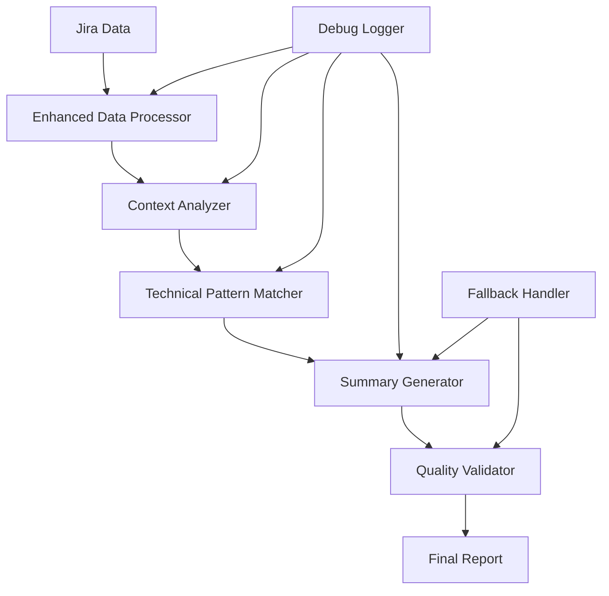

# Design Document

## Overview

The current LLM analysis in my-day CLI has several issues that prevent accurate summarization of Jira ticket activity:

1. **Incomplete Data Processing**: The embedded LLM doesn't effectively process the full context of issues and comments
2. **Poor Summary Aggregation**: Individual ticket summaries aren't properly combined into meaningful standup overviews
3. **Limited Technical Context**: The rule-based system doesn't capture enough DevOps-specific terminology and patterns
4. **Debugging Difficulties**: No visibility into why summaries are incorrect or missing

This design addresses these issues through improved algorithms, better data flow, and enhanced debugging capabilities.

## Architecture

### Current Issues Identified

From code analysis, the main problems are:

1. **GenerateStandupSummary** in embedded.go only provides basic counts instead of meaningful content analysis
2. **Comment processing** focuses on individual comments but doesn't aggregate insights across tickets
3. **Rule-based summarization** is too simplistic and misses important technical context
4. **Error handling** silently fails without providing feedback to users

### Proposed Architecture Changes



## Components and Interfaces

### 1. Enhanced Data Processor

**Purpose**: Improve how raw Jira data is processed before summarization

**Interface**:
```go
type EnhancedDataProcessor interface {
    ProcessIssuesWithComments(issues []IssueWithComments) (*ProcessedData, error)
    ExtractTechnicalContext(comments []Comment) (*TechnicalContext, error)
    IdentifyWorkPatterns(comments []Comment) ([]WorkPattern, error)
}

type ProcessedData struct {
    Issues           []EnhancedIssue
    TechnicalContext *TechnicalContext
    WorkPatterns     []WorkPattern
    TimelineEvents   []TimelineEvent
}

type TechnicalContext struct {
    Technologies     []string
    Environments     []string
    Actions          []string
    Deployments      []DeploymentActivity
    Infrastructure   []InfrastructureWork
}
```

### 2. Context Analyzer

**Purpose**: Analyze the broader context of work across multiple tickets

**Interface**:
```go
type ContextAnalyzer interface {
    AnalyzeWorkContext(data *ProcessedData) (*WorkContext, error)
    IdentifyPriorities(context *WorkContext) ([]Priority, error)
    DetectWorkflows(context *WorkContext) ([]Workflow, error)
}

type WorkContext struct {
    MainFocusAreas   []string
    CompletedWork    []WorkItem
    InProgressWork   []WorkItem
    BlockedWork      []WorkItem
    UpcomingWork     []WorkItem
}
```

### 3. Technical Pattern Matcher

**Purpose**: Improve recognition of DevOps and technical patterns

**Interface**:
```go
type TechnicalPatternMatcher interface {
    MatchInfrastructurePatterns(text string) ([]InfrastructurePattern, error)
    MatchDeploymentPatterns(text string) ([]DeploymentPattern, error)
    MatchDevelopmentPatterns(text string) ([]DevelopmentPattern, error)
}

type InfrastructurePattern struct {
    Type        string // "terraform", "aws", "kubernetes", etc.
    Action      string // "deploy", "configure", "update", etc.
    Component   string // specific resource or service
    Status      string // "completed", "in-progress", "blocked"
}
```

### 4. Enhanced Summary Generator

**Purpose**: Generate more accurate and contextual summaries

**Interface**:
```go
type EnhancedSummaryGenerator interface {
    GenerateTicketSummary(issue EnhancedIssue) (string, error)
    GenerateWorkSummary(context *WorkContext) (string, error)
    GenerateStandupSummary(context *WorkContext) (string, error)
    GenerateDetailedSummary(context *WorkContext) (string, error)
}
```

### 5. Debug Logger

**Purpose**: Provide visibility into LLM processing for troubleshooting

**Interface**:
```go
type DebugLogger interface {
    LogProcessingStep(step string, data interface{})
    LogPatternMatches(patterns []Pattern)
    LogSummaryGeneration(input, output string)
    GetDebugReport() (*DebugReport, error)
}
```

## Data Models

### Enhanced Issue Structure
```go
type EnhancedIssue struct {
    Issue            jira.Issue
    Comments         []jira.Comment
    ProcessedComments []ProcessedComment
    TechnicalContext *TechnicalContext
    WorkSummary      string
    Priority         int
}

type ProcessedComment struct {
    Original         jira.Comment
    ExtractedActions []string
    TechnicalTerms   []string
    WorkType         string
    Sentiment        string
    Importance       int
}
```

## Error Handling

### Graceful Degradation Strategy

1. **Primary Path**: Enhanced LLM analysis with full context
2. **Fallback Level 1**: Basic rule-based analysis with improved patterns
3. **Fallback Level 2**: Simple metadata-based summaries
4. **Fallback Level 3**: Raw ticket titles and status

### Error Reporting
- Clear error messages explaining what went wrong
- Suggestions for resolution (e.g., "Run sync to refresh data")
- Debug mode showing processing steps

## Testing Strategy

### Unit Tests
- Test individual pattern matchers with known DevOps terminology
- Test summary generation with various comment types
- Test fallback behavior with malformed data

### Integration Tests
- Test full pipeline with real Jira data samples
- Test different LLM modes (embedded vs Ollama)
- Test error scenarios and recovery

### Performance Tests
- Measure processing time for large comment sets
- Test memory usage with multiple tickets
- Benchmark different summarization approaches

## Implementation Phases

### Phase 1: Enhanced Data Processing
- Implement ProcessedData structures
- Improve comment analysis and technical term extraction
- Add basic pattern matching for common DevOps terms

### Phase 2: Context Analysis
- Implement WorkContext analysis
- Add priority detection and workflow identification
- Improve cross-ticket correlation

### Phase 3: Summary Generation
- Rewrite GenerateStandupSummary with enhanced logic
- Add multiple summary formats (brief, detailed, technical)
- Implement intelligent content prioritization

### Phase 4: Debug and Monitoring
- Add comprehensive debug logging
- Implement summary quality validation
- Add user feedback mechanisms

## Configuration Options

### New Configuration Parameters
```yaml
llm:
  enabled: true
  mode: "embedded"
  debug: false
  summary_style: "technical" # technical, business, brief
  max_summary_length: 200
  include_technical_details: true
  prioritize_recent_work: true
  fallback_strategy: "graceful" # graceful, strict, minimal
```

## Backward Compatibility

- Existing LLM interface remains unchanged
- New features are opt-in through configuration
- Fallback to current behavior if new components fail
- Gradual migration path for users